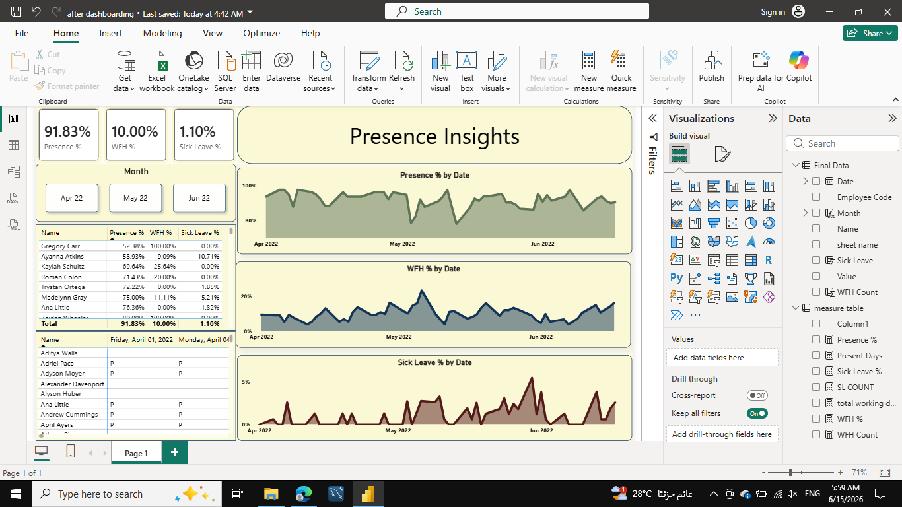

# HR-Attendance-Analysis
Power BI dashboard for analyzing employee attendance, work-from-home usage, and sick leave trends.
# HR Attendance Analysis Dashboard

## Project Overview

This project analyzes employee attendance data to monitor attendance patterns, work-from-home utilization, and sick leave trends. An interactive Power BI dashboard was developed to help HR teams and managers gain insights into workforce attendance behavior and support data-driven decision-making.

---

## Objectives

The project aims to:

- Track overall employee attendance.
- Monitor work-from-home (WFH) usage.
- Analyze sick leave trends.
- Identify attendance variations among employees.
- Compare attendance metrics across different months.
- Support HR decision-making through interactive visualizations.

---

## Dataset Information

**Dataset:** HR Attendance Dataset

**Period Covered:** April 2022 – June 2022

**Data Includes:**
- Employee attendance records
- Work-from-home records
- Sick leave records
- Leave status information

---

## Tools & Technologies

- Power BI
- Power Query
- DAX
- Microsoft Excel

---

## Data Preparation

The dataset was prepared and transformed using Power Query. The preparation process included:

- Data import and validation
- Data cleaning and transformation
- Date-related calculations
- Creation of custom DAX measures
- Development of attendance KPIs

Key measures created:

- Attendance %
- Work From Home %
- Sick Leave %

---

## Dashboard Features

The dashboard provides:

- Attendance KPI tracking
- Work-from-home monitoring
- Sick leave trend analysis
- Employee attendance comparison
- Employee WFH comparison
- Monthly attendance analysis
- Interactive filtering using slicers

---

## Key Findings

- Overall attendance remained high at 91.83%, indicating strong employee presence throughout the analyzed period.
- Work-from-home accounted for 10% of total workdays, showing that remote work played a meaningful role in employee operations.
- Sick leave remained low at 1.10%, suggesting limited absenteeism due to illness.
- Attendance levels experienced periodic fluctuations despite the high overall attendance rate.
- Work-from-home utilization varied across different dates and periods.
- Temporary spikes in sick leave were observed on specific dates and may warrant further investigation.
- Employee attendance behavior differed significantly across individuals.
- Work-from-home adoption was not evenly distributed among employees.

---

## Dashboard Preview

### Main Dashboard

---

## Future Improvements

Potential future enhancements include:

- Department-level attendance analysis
- Additional leave category analysis
- Attendance forecasting
- Advanced workforce analytics
- Employee segmentation and clustering

---

## Project Files

- Dashboard.pbix
- Dataset.xlsx
- Dashboard Screenshot

---

## Author

Developed as part of a Power BI Data Analysis project to practice data cleaning, data modeling, DAX calculations, dashboard design, and business insight generation.
